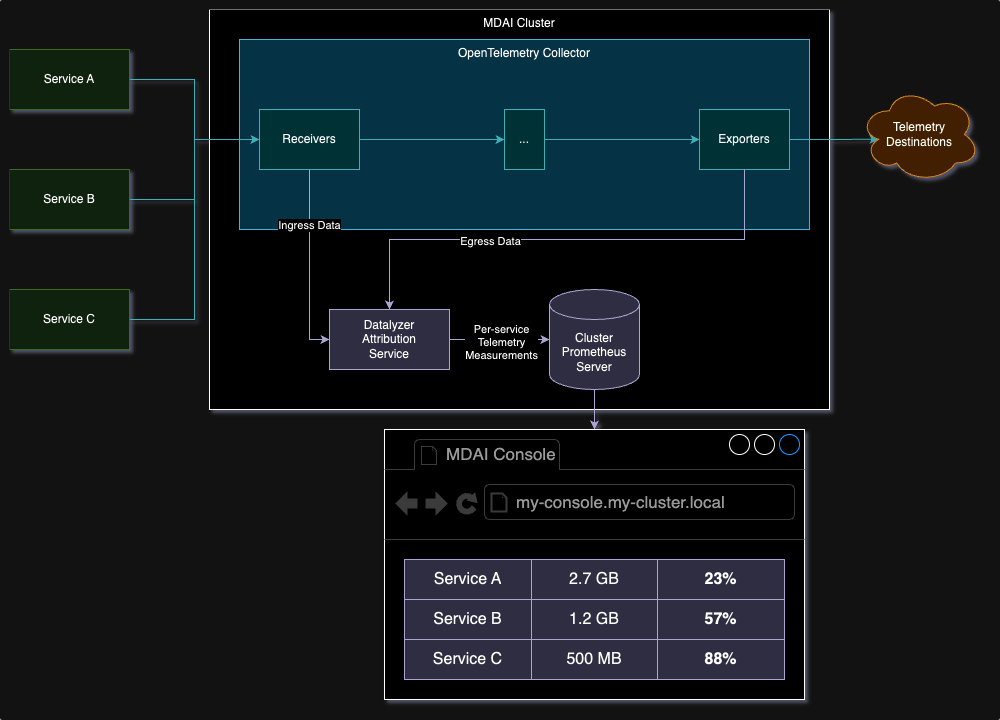
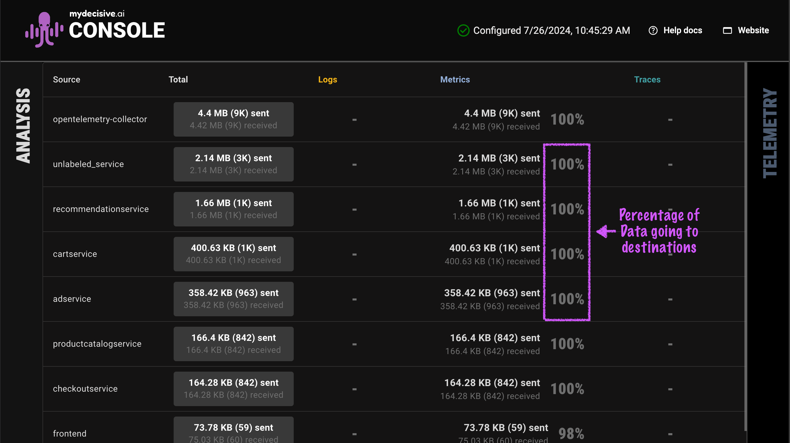

# Source Attribution

## What is it?

Different services, applications, hosts and other parts of your software estate emit telemetry differently, and the Source Attribution Module in the MDAI Cluster can help you see which services are sending the most telemetry data, and potentially costing the most to store that telemetry data.

  <em>The Datalyzer Service measures telemetry data per-source</em>

### Components of the Source Attribution Module:

- The Datalyzer, a lightweight OTLP service that measures Telemetry data on a per-service basis, completely within your cluster
- The MDAI Operator, which directs data from your Telemetry pipelines to the Datalyzer for measurement
- The MDAI Console Analysis View, which displays per-service telemetry measurements and the ratio of outgoing to incoming data.

  <em>The MDAI Console displaying per-service Telemetry measures for the OpenTelemetry Demo</em>

## How to enable

### MDAI CLI

### k8s

## How to disable

### MDAI CLI

### k8s
