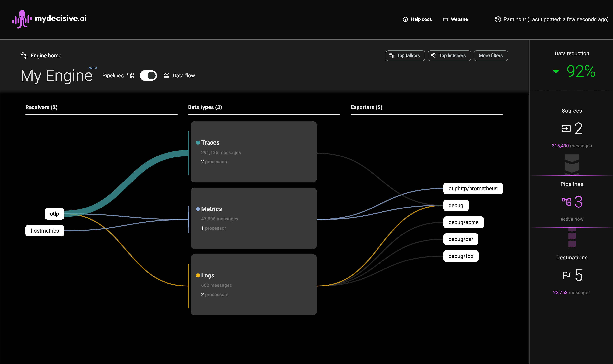

# The MyDecisive Engine Console

<!-- toc -->

## Introduction

The MyDecisive Engine console provides an at-a-glance display of all the telemetry data that has flowed through your MDAI Engine in the last hour. It is a web application accessible via HTTPS within the engine.

## Data Flow Overview

The console offers three primary areas to help you understand how your data flows:
Sankey Diagram: 
A. The main section displays a Sankey diagram showing the data flow.
B. Filters: Filters at the top allow you to customize what you see.
C.Sidebar: On the right, a sidebar summarizes your data totals and data reduction.

### Sankey Diagram

 

The initial view (A) of the diagram shows how your different data types (Metrics, Logs, and Traces) flow from receivers to exporters, allowing you to see the overall data volumes flowing through the system.

Hovering over any component highlights the specific data path(s), helping you zero in on a specific issue.

<!--Screenshot of the hover view - make it exactly the same size and ratio as the initial screen-->

 

## Pipeline View

 

Clicking on any component in the Sankey diagram will filter and switch the view to a pipeline view. This shows all data types interacting with that component and highlights its configuration in the textual configuration view, allowing you to see the composition of your pipeline.

 

 

As you view the console to understand your data flows, you can switch between Pipeline and Data flow view at any time to see the appropriate elevation.

## Filters

 

The filters (B) at the top-right of the console allow you to constrain the data flow and pipeline views to specific components or data types. These filters can be combined, and options are automatically refined based on your selections.

#### Top Talkers and Top Listeners

The Top Talkers filter shows the top three receivers by data volume, and the Top Listeners filter shows the top three exporters by data volume.

#### More Filters

The More Filters menu allows you to filter your view by receiver, processor, data type, or exporter.

## Summary of Data Totals and Data Reduction

The console sidebar (C) displays:

- A count of receivers, pipelines, and exporters running on your collectors
- The total volume of data flowing through them in the last hour

The sidebar updates with other changes on the page, allowing you to optimize your pipelines for maximum cost efficiency.

> Note: Traffic flowing to debug exporters is not counted in data flow totals.
