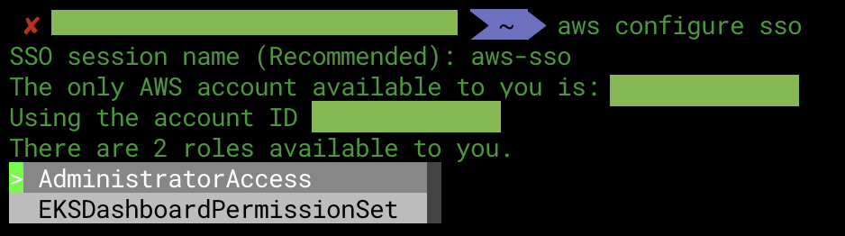
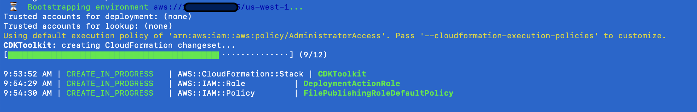
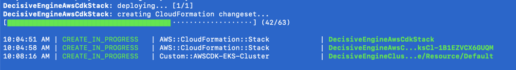
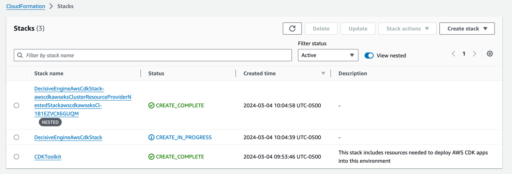
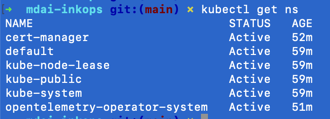
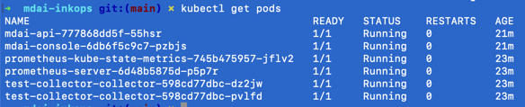
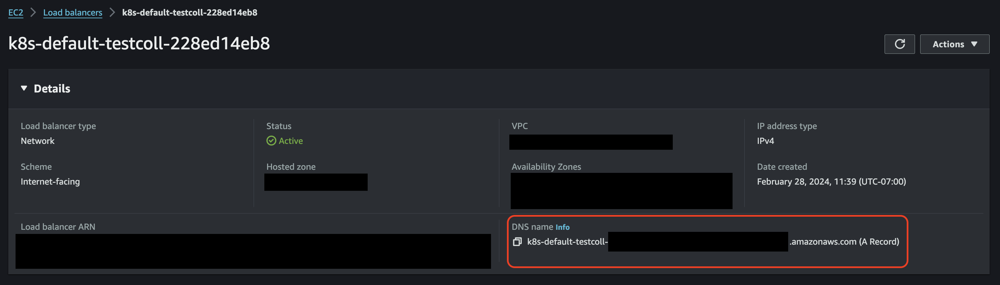

# Cloud Install - AWS

<!-- toc -->

## Setup the MDAI Engine™ in AWS

You are going to learn to do the following:

* Send telemetry to the MDAI Engine™
* Access the MDAI Engine Console™ to verify data flowing through the MDAI Engine™
* Set up and run a cloud instance of MDAI Engine™

## Prerequisites

### System Requirements

Make sure that your developer environment has the following. This page assumes that you’re using bash. Adapt configuration and commands as necessary for your preferred shell.

- Install [Go](https://go.dev/dl/) (1.20 or higher) from source or use homebrew `brew install go`
- [GOBIN environment variable](https://pkg.go.dev/cmd/go#hdr-Environment_variables) is set; if unset, initialize it appropriately, for example:

```
export GOBIN=${GOBIN:-$(go env GOPATH)/bin}
```

- Install [npm](https://nodejs.org/en/download) from source or use homebrew `brew install npm`
- Install [AWS CDK Toolkit](https://docs.aws.amazon.com/cdk/v2/guide/cli.html) from source or use homebrew `brew install aws-cdk`. AWS CDK (requires Node.js ≥ 14.15.0)
<!-- * Install [docker](https://www.docker.com/get-started/)-->

### AWS SSO

- Install [AWS SSO](https://docs.aws.amazon.com/cli/latest/userguide/sso-configure-profile-token.html)
- Login via the CLI

```shell
aws configure sso
```

- After configuration is complete, make sure you choose the correct AWS account you want to deploy your engine to.
  

### AWS CDK

Install AWS CDK CLI
```shell
npm install -g aws-cdk
```
You can find more information in the [AWS CDK Install Guide](https://docs.aws.amazon.com/cdk/v2/guide/getting_started.html#getting_started_install).

## Installing the MDAI™ Engine in AWS

Please pull down the [MDAI InkOps™](https://github.com/DecisiveAI/mdai-inkops) toolkit. The InkOps toolkit will enable you to configure and deploy the MDAI Engine™ infrastructure in AWS.

`git clone git@github.com:DecisiveAI/mdai-inkops.git`

### Update the environment configuration file

Navigate to the `values/aws.env` file and start inputting the environment configuration that's relevant to your AWS account.

```
# region where the engine going to be installed
AWS_REGION=
# AWS account to be used
AWS_ACCOUNT=
# AWS profile to be used
AWS_PROFILE=
# Class and size of the EC2 used for EKS k8s cluster
# this is the minimum required configuration, adjust to your needs
MDAI_EC2_INSTANCE_CLASS=t2
MDAI_EC2_INSTANCE_SIZE=micro
# Number of cluster EC2 nodes
MDAI_CLUSTER_CAPACITY=10
# Amazon Resource Name (ARN) of the certificate to be used for the Engine UI endpoint
MDAI_UI_ACM_ARN=
```


### Update the OTel configuration file

Ready to start collecting date via an OTel Collector? We have a few options...


#### Option 1 - Use our boilerplate

We provided the default configuration for the Open Telemetry collector at `templates/otel-tmpl.yaml`. Using our boilerplate will accelerate your deployment. If you have modifications you need to make, just follow the update commands in Option 2 below.

Find more information in the spec for the [OTEL Collector](https://opentelemetry.io/docs/collector/) to make the best decisions for your telemetry pipelines configuration.

#### Option 2 - BYO Config

Ready to commit to using your OTel configuration using using the MDAI Engine™? Simply update the configuration file (`values/otel-config.yaml`) with your config then apply it to the cluster.

```bash
### Apply changes to the cluster
kubectl apply -f values/otel-config.yaml
```

### Configure the MDAI™ Engine

```shell
make config
```


### Deploy the MDAI™ Engine

```shell
make install
```
- Install will check and bootstrap the CDK Toolkit if it's not present for the region.

- CDK will output the detected changes and ask to accept or reject the changes. Review carefully before proceeding.

- Follow the progress of the stack creation through the terminal

or AWS Console -> Cloud Formation

- The installation process will add a new context to your `kubeconfig`. You can switch context by running `kubectl config use-context <desired_context>`
Detailed output stored into `cdk-output.json`.
### Verify the MDAI™ Engine
Ensure your cluster is up and running.  
List all namespaces:
```shell
kubectl get ns
```
Expected output  

```shell
kubectl get pods
```
Your output for default configuration should be similar to


### Enable access to Engine via DNS Mappings to Load Balancer Endpoints

There are three entry points to the engine:

1. **gRPC Load Balancer Endpoint** - enables gRPC telemetry to be sent to the engine.
2. **http Load Balancer Endpoint** - enables http telemetry to be sent to the engine
3. **console-ui Load Balancer Endpoint** - serves the MDAI Console for monitoring your engine instance

In order to enable access allowed external access to the engine, you need to do the following:

**Identify the Load Balancer DNS names**

1. In the AWS Console, navigate to your [EC2 Load Balancers endpoints](https://us-east-1.console.aws.amazon.com/ec2/home?region=us-east-1#LoadBalancers) _Note: link above take you to region: us-east-1, you will need to change if you've deployed your engine in a different region_
2. Locate the three load balancers required to run an MDAI Engine™, there should be a gRPC, http, and console-ui load balancer. Make note of each of the load balancer's DNS names. ](../media/load-balancers.png)

**Generate Certificates for secure connections to your MDAI Engine™ Instance**
Follow the instructions in the [AWS ACM Certificate Request Guide](https://docs.aws.amazon.com/acm/latest/userguide/gs-acm-request-public.html#request-public-console) to verify your domain and acquire a certificate for secure connections to your MDAI Engine™ instance.

**Certificate Strategy**
_Option 1: Default setup_

1. **gRPC certificate** - enables a secure connection to the gRPC endpoint of your engine instance
2. **non-gRPC cert** - enables a secure connection to the non-gRPC endpoint of your engine instance
3. **console-ui certificate** - enables a secure connection to the engine console within your engine instance

_Option 2: Wildcard setup_

This will allow you to use a single certificate for all your endpoints.

> Note: AWS doesn't provide free wildcard certificates.

**Update the DNS Mapping**

1. Log into your Domain Administrator Tool
2. Update DNS mapping ([GoDaddy Example](https://www.godaddy.com/help/add-a-cname-record-19236)) to add a CNAME Record for each relevant Load Balancers created by engine.

**DNS CNAME mappings**
There is a 1:1 ratio for each load balancer endpoint to CNAME Record.

1. **gRPC CNAME** - maps the the gRPC endpoint(s) of your engine instance to your custom-domain. We recommend using `grpc-#` for your CNAME record.
2. **non-gRPC CNAME** - maps the the non-gRPC endpoint(s) of your engine instance to your custom-domain. We recommend using `non-grpc-#` for your CNAME record.
3. **console-ui CNAME** - maps the MDAI Engine™ Console within your engine instance to your custom-domain. You'll be able to access the endpoint <cname>.<your-domain>.<domain-suffix> _e.g., https://mydecisive-console.example.com/_

## Disable Engine

- Set replica count to `0` in `values/params-values-otel.yaml`:

```yaml
spec:
  # 2 replicas recommended
  replicas: 0
```

- `make config`
- `make install`

## Enable Engine

- Set replica count to `2` in `values/params-values-otel.yaml`:

```yaml
spec:
  # 2 replicas recommended
  replicas: 2
```

- `make config`
- `make install`

## Destroy the MDAI Engine™

Tired of using the MDAI Engine™? 😭 We're sorry to see you go, but we understand. If you have feedback for us, please fill out.

Follow the steps below to destroy the AWS Stack.
Due to AWS CDK limitations several additional steps required to fully remove all MDAI Engine™ resources from AWS.

- Delete the Open Telemetry Collector
  ```shell
  kubectl delete otelcol/<your_collector_name>
  ```
- Destroy MDAI Engine™ stack
  ```shell
  cdk destroy --profile <your_aws_profile>
  ```
- The destroy process will run for a while and may return an error due some resources having dependencies.
Delete listed dependencies by following steps below or through AWS Console.

    - Run the command bellow to check if UI load balancer has to be deleted:
        ```shell
        aws elbv2 describe-load-balancers \
        --region <your_region>  \
        --profile <your_profile> \
        --query "LoadBalancers[?contains(LoadBalancerName,'mydecisive-engine-ui')].{ARN:LoadBalancerArn}" \
        --output text
        ```
    - Use the ARN from the command above to delete pending load balancer:
        ```shell
        aws elbv2 delete-load-balancer \
        --load-balancer-arn <your_load_balancer_arn> \
        --region <your_region> \
        --profile <your_profile>
        ```
    - Delete security groups if the destroy failed to delete the VPC. Use the VPC ID from the cdk error output:
        ```bash
        for sg_id in $(aws ec2 describe-security-groups --region <your_region> --filters Name=vpc-id,Values='<your_vpc_id>' --query 'SecurityGroups[?GroupName!=`default`].[GroupId]' --output text); do
            aws ec2 delete-security-group --group-id $sg_id --region <your_region>
            echo "Deleted security group $sg_id"
        ```
- Run the destroy process again.

## Generate and Collect telemetry

**What kind of user are you?**

1. I don't have any agents/collectors that I want to use at this time to send telemetry. Use Option 1!
2. I have sources of telemetry I'd love to send to my MDAI Engine™! Use Option 2!

### Option 1 - Use test data

1. Setup a Cronjob (or use on from the )
2. Apply to cluster
3. See telemetry coming through
4. Delete the job after you're done

_It is critical that you delete the cronjob, otherwise engine costs will increase as throughput and processing power are resource intense._

> Note: This is a great option if you're not ready to commit to the costs associated with ingress/egress. It's all local to the cluster you have just deployed, so there will not be additional charges, minus the compute required to generate and process the telemetry.

### Option 2 - Use real data

1. Find the source of data (collector/agent) you'd like to point at your MDAI Engine™ instance
2. Use your CNAME (from your host provider) or DNS (from AWS LB)
3. Configure your agent/collector to point to the CNAME or DNS
4. SEE RESULTS! Go to Visualization step for more details.

## Validate data flow

1. Go to your AWS lb link
2. View the [MDAI Console™](localhost:5173) in AWS.
3. As telemetry flows through the engine, you will see counts increase in the console, color-coded by telemetry type. 🐙🎉


> Note: Data flowing to `debug` exporters are not counted towards data flow totals in the right sidebar


## Next steps
