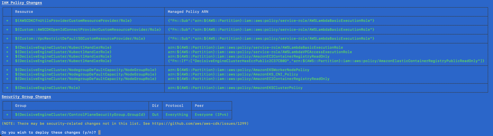

# Cloud Install - AWS

<!-- toc -->

## Setup the MDAI Engine™ in AWS

You are going to learn to do the following:

* Send telemetry to the MDAI Engine™
* Access the MDAI Engine Console™ to verify data flowing through the MDAI Engine™
* Set up and run a cloud instance of MDAI Engine™

## Prerequisites

### System Requirements

Make sure that your developer environment has the following. This page assumes that you’re using bash. Adapt configuration and commands as necessary for your preferred shell.

- Install [Go](https://go.dev/dl/) (1.20 or higher) from source or use homebrew `brew install go`
- [GOBIN environment variable](https://pkg.go.dev/cmd/go#hdr-Environment_variables) is set; if unset, initialize it appropriately, for example:

```
export GOBIN=${GOBIN:-$(go env GOPATH)/bin}
```

- Install [npm](https://nodejs.org/en/download) from source or use homebrew `brew install npm`
- Install [AWS CDK Toolkit](https://docs.aws.amazon.com/cdk/v2/guide/cli.html) from source or use homebrew `brew install aws-cdk`. AWS CDK (requires Node.js ≥ 14.15.0)
<!-- * Install [docker](https://www.docker.com/get-started/)-->

### AWS SSO

- Install [AWS SSO](https://docs.aws.amazon.com/cli/latest/userguide/sso-configure-profile-token.html)
- Login via the CLI

```shell
aws configure sso
```

- After configuration is complete, make sure you choose the correct AWS account you want to deploy your engine to.
  

### AWS CDK

Install AWS CDK CLI
```shell
npm install -g aws-cdk
```
You can find more information in the [AWS CDK Install Guide](https://docs.aws.amazon.com/cdk/v2/guide/getting_started.html#getting_started_install).

## Installing the MDAI™ Engine in AWS

Please pull down the [MDAI InkOps™](https://github.com/DecisiveAI/mdai-inkops) toolkit. The InkOps toolkit will enable you to configure and deploy the MDAI Engine™ infrastructure in AWS.

`git clone git@github.com:DecisiveAI/mdai-inkops.git`

### Update the environment configuration file

Navigate to the `values/aws.env` file and start inputting the environment configuration that's relevant to your AWS account.

```
# region where the engine going to be installed
AWS_REGION=
# AWS account to be used
AWS_ACCOUNT=
# AWS profile to be used
AWS_PROFILE=
# Class and size of the EC2 used for EKS k8s cluster
# this is the minimum required configuration, adjust to your needs
MDAI_EC2_INSTANCE_CLASS=t2
MDAI_EC2_INSTANCE_SIZE=micro
# Number of cluster EC2 nodes
MDAI_CLUSTER_CAPACITY=10
# Amazon Resource Name (ARN) of the certificate to be used for the Engine UI endpoint
MDAI_UI_ACM_ARN=
```

### Update the OTel configuration file

Ready to start collecting date via an OTel Collector? We have a few options...

#### Update Collector Configuration
We provided the default configuration for the Open Telemetry collector at `values/otelcol-config.yaml`. 

Open and edit `values/params-values-otel.yaml` by following the comments in the file:
```
metadata:
  name: test-collector
  namespace: default
  annotations:
    # MUST BE SPECIFIED!
    # add certificate arn for non-grpc endpoint 
    service.beta.kubernetes.io/aws-load-balancer-ssl-cert: arn:aws:acm:<your_region>:<certificate_details>
```
```
spec:
  ingress:
    annotations:
      # MUST BE SPECIFIED!
      # add certificate arn (or multiple certificates arn, coma separated) for the grpc endpoints
      alb.ingress.kubernetes.io/certificate-arn: arn:aws:acm:us-east-1:168005146325:certificate/ac21c0a8-9772-43f0-ac16-4d4b9f7bab3d
```
Using our boilerplate will accelerate your deployment. If you have modifications you need to make, just follow the update commands in Option 2 below.  
Find more information in the spec for the [OTEL Collector](https://opentelemetry.io/docs/collector/) to make the best decisions for your telemetry pipelines configuration.

#### Option 2 - BYO Config
Ready to commit to using your OTel configuration using the MDAI Engine™? Simply update the configuration file (`values/otel-config.yaml`).

### Configure the MDAI™ Engine

After you've configured your engine, you can run the `config` command to automate the update to configuration files.

```shell
make config
```

### Deploy the MDAI™ Engine

```shell
make install
```
- Install will check and bootstrap the CDK Toolkit if it's not present for the region.
](../media/img.png)
- CDK will output the detected changes and ask to accept or reject the changes. Review carefully before proceeding.
](../media/img_1.png)
- Follow the progress of the stack creation through the terminal
](../media/img_2.png)
or AWS Console -> Cloud Formation
](../media/img_3.png)
- The installation process will add a new context to your `kubeconfig`. You can switch context by running `kubectl config use-context <desired_context>`
Detailed output stored into `cdk-output.json`.

### Verify the MDAI™ Engine
Ensure your cluster is up and running.
List all namespaces:
```shell
kubectl get ns
```
Expected output

```shell
kubectl get pods
```
Your output for default configuration should be similar to
](../media/img_4.png)

### Configure Ingress for your MDAI Engine™

To securely setup ingress and external access to your MDAI Engine™, checkout our [Ingress](./ingress.md) documentation.

## Disable Engine

- Set replica count to `0` in `values/params-values-otel.yaml`:

```yaml
spec:
  # 2 replicas recommended
  replicas: 0
```

- `make config`
- `make install`

## Enable Engine

- Set replica count to `2` in `values/params-values-otel.yaml`:

```yaml
spec:
  # 2 replicas recommended
  replicas: 2
```

- `make config`
- `make install`

## Destroy the MDAI Engine™

Tired of using the MDAI Engine™? 😭 We're sorry to see you go, but we understand. If you have feedback for us, please fill out.

Follow the steps below to destroy the AWS Stack.
Due to AWS CDK limitations several additional steps required to fully remove all MDAI Engine™ resources from AWS.

- Delete the Open Telemetry Collector
  ```shell
  kubectl delete otelcol/<your_collector_name>
  ```
- Destroy MDAI Engine™ stack
  ```shell
  cdk destroy --profile <your_aws_profile>
  ```
- The destroy process will run for a while and may return an error due some resources having dependencies.
Delete listed dependencies by following steps below or through AWS Console.

    - Run the command bellow to check if UI load balancer has to be deleted:
        ```shell
        aws elbv2 describe-load-balancers \
        --region <your_region>  \
        --profile <your_profile> \
        --query "LoadBalancers[?contains(LoadBalancerName,'mdai-console')].{ARN:LoadBalancerArn}" \
        --output text
        ```
    - Use the ARN from the command above to delete pending load balancer:
        ```shell
        aws elbv2 delete-load-balancer \
        --load-balancer-arn <your_load_balancer_arn> \
        --region <your_region> \
        --profile <your_profile>
        ```
    - Delete security groups if the destroy failed to delete the VPC. Use the VPC ID from the cdk error output:
        ```bash
        for sg_id in $(aws ec2 describe-security-groups --region <your_region> --filters Name=vpc-id,Values='<your_vpc_id>' --query 'SecurityGroups[?GroupName!=`default`].[GroupId]' --output text); do
            aws ec2 delete-security-group --group-id $sg_id --region <your_region>
            echo "Deleted security group $sg_id"
        done
        ```
- Run the destroy process again.

## Generate and Collect telemetry

**What kind of user are you?**

1. I don't have any agents/collectors that I want to use at this time to send telemetry. **Use Option 1!**
2. I have sources of telemetry I'd love to send to my MDAI Engine™! **Use Option 2!**

### Option 1 - Use test data

1. Setup a Cronjob (or use on from the )
2. Apply to cluster
3. See telemetry coming through
4. Delete the job after you're done

_It is critical that you delete the cronjob, otherwise engine costs will increase as throughput and processing power are resource intense._

> Note: This is a great option if you're not ready to commit to the costs associated with ingress/egress. It's all local to the cluster you have just deployed, so there will not be additional charges, minus the compute required to generate and process the telemetry.

### Option 2 - Use real data

1. Find the source of data (collector/agent) you'd like to point at your MDAI Engine™ instance
2. Use your CNAME (from your host provider) or DNS (from AWS LB)
3. Configure your agent/collector to point to the CNAME or DNS
4. SEE RESULTS! Go to Validate step for more details.

## Validate data flow

1. Go to your AWS lb link
2. View the [MDAI Console™](localhost:5173) in AWS.
3. As telemetry flows through the engine, you will see counts increase in the console, color-coded by telemetry type. 🐙🎉


> Note: Data flowing to `debug` exporters are not counted towards data flow totals in the right sidebar


## 🎉 🐙 🎉 You did it! 🎉 🐙 🎉

That's all for now! Enjoy using your MDAI Engine for visibility into your o11y costs and taking control back into your hands.

Do you have any Feedback for us? Please let us know how we can improve by:
* Filling our our 
* Emailing us Feedback to our 
