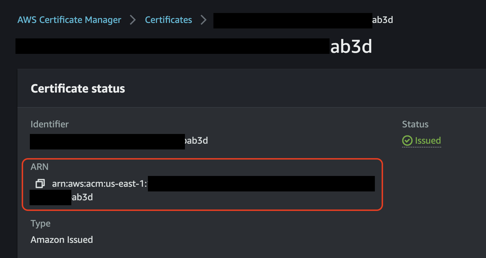

## 🔒 Securing your Engine with Certs!

*🙆‍♀️ Let's take a quick stretch break..*

You might be feeling like this right now "🙄 ... more configs?!?"

😬 We know, we know.. so many options.

Trust us, we're truly here to help ease the pain of configuration and security for your MDAI Engine. Hang with us, we're so close to done!

*🙆🏽‍♂️ Okay.. one more stretch.. that's better.. back to it!*

### Step 1: Assigning SSL Certificates for your custom domain

#### Option 1: 🚜 AutoGen a Cert

Let us help! We created a simple command that not only autogenerates a cert, it also uploads your cert to your AWS account based on your `aws.env` values you updated earlier.

```shell
make cert
```

#### Option 2: 🤝 BYO Cert

[ACM Import Instructions](https://docs.aws.amazon.com/acm/latest/userguide/import-certificate-api-cli.html)

Once you have access to your certificate in AWS ACM, it will be accessible via Amazon Resource Name (ARN). These ARNs need to be provided as a configuration parameter during the configuration phase, so make note of these ARNs. [](../../media/acm-certificates.png)

*🚨 ‼️ **NOTE: Don't forget to copy that ARN from either step!** ‼️ 🚨*

### Step 2. Adding your cert ARN to the right places

🪰 Remember that ARN we keep pestering you about? 🪰

Let's add it to the `values/params-values-otel.yaml` file as the values for the following keys:
* `service.beta.kubernetes.io/aws-load-balancer-ssl-cert`
* `alb.ingress.kubernetes.io/certificate-arn`

----
<span class="left"><a href="./otel-config.md">⏪ Back to: OTel Configuration</a></span>
<span class="right"><a href="./apply-config.md">Next Step: Applying configuration ⏩</a></span>
