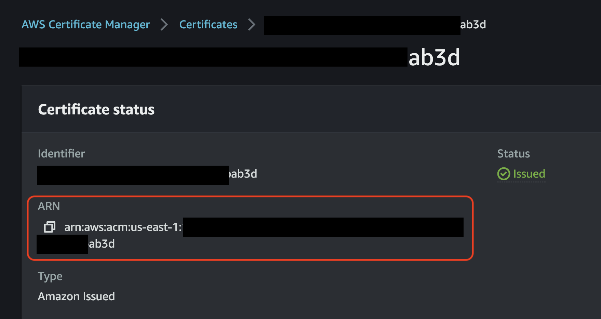
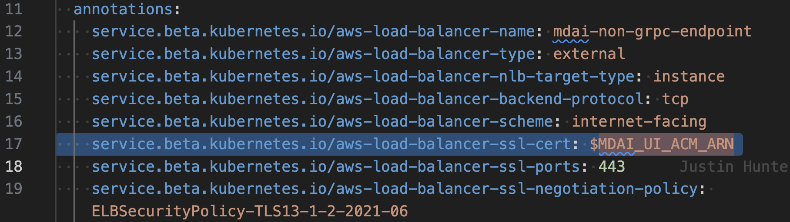
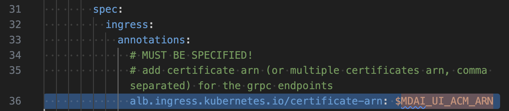

# 🔒 Securing your MDAI Cluster with Certs!
----

*🙆‍♀️ Let's take a quick stretch break..*

You might be feeling like this right now "🙄 ... more configs?!?"

😬 We know, we know.. so many options.

Trust us, we're truly here to help ease the pain of configuration and security for your MDAI Cluster. Hang with us, we're so close to done!

*🙆🏽‍♂️ Okay.. one more stretch.. that's better.. back to it!*

## Assigning SSL Certificates to your ingress endpoints

### Option 1: 🚜 AutoGen a Cert

Let us help! We created a simple command that not only autogenerates a cert, it also uploads your cert to your AWS account based on your `aws.env` values you updated earlier.

```shell
make cert
```

**🎉 CERT GENERATION COMPLETE! 🎉**

*There are no further steps for this option. You can move on to applying your configurations*


<span class="right"><a href="./apply-config.md">Next Step: Applying configuration ⏩</a></span>
<br /><br />

### Option 2: 🧳 BYO Cert

Once you have access to your certificate in AWS ACM, it will be accessible via Amazon Resource Name (ARN). These ARNs need to be provided as a configuration parameter during the configuration phase, so make note of these ARNs. [](../../media/acm-certificates.png)

*🚨 ‼️ **NOTE: If you BYO cert, please copy the cern ARN after you import it to ACM!** ‼️ 🚨*

#### Manual step: Add Cert ARN to your OTel config

*🪰 Remember that ARN we just pestered you about above? 🪰*

Let's add it to the `templates/mdai-operator.yaml` file as the values for the following keys
* `service.beta.kubernetes.io/aws-load-balancer-ssl-cert`



* `alb.ingress.kubernetes.io/certificate-arn`



----
<span class="left"><a href="./otel-config.md">⏪ Back to: OTel Configuration</a></span>
<span class="right"><a href="./apply-config.md">Next Step: Applying configuration ⏩</a></span>
