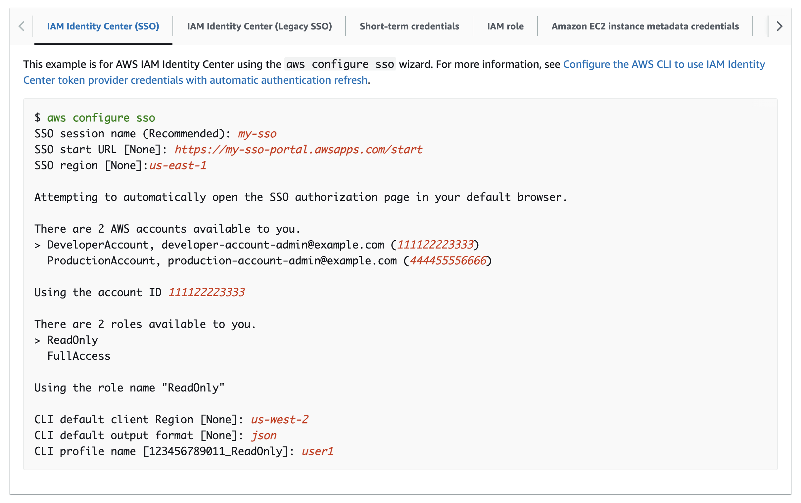
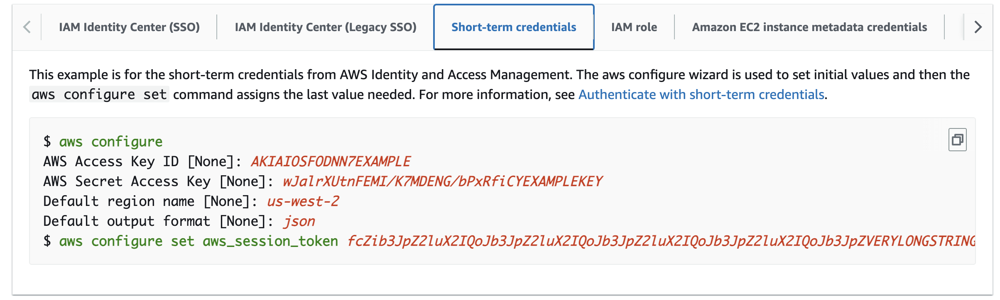

# Programatic Access for AWS CLI
----

To deploy an MDAI Cluster, we use the [AWS CLI](https://docs.aws.amazon.com/cli/latest/userguide/cli-chap-welcome.html) for access and control to the various AWS tech we leverage.

## Pre-requisites

Before you install a cluster, you will need to Create an [AWS IAM Admin Account](https://docs.aws.amazon.com/cli/latest/userguide/getting-started-prereqs.html#getting-started-prereqs-iam)

## Setup the AWS CLI

We've found the [Gettings Started with the AWS CLI](https://docs.aws.amazon.com/cli/latest/userguide/getting-started-quickstart.html#getting-started-quickstart-new) gude extremely helpful in setting up everything from pre-requisites, to programatic access via your desired terminal tools.

There are two methods we recommend for programatic access to your AWS resources via the AWS CLI, though there are more that you can access the CLI with and can be found [here](https://docs.aws.amazon.com/cli/latest/userguide/getting-started-quickstart.html#getting-started-quickstart-new-command)

### Option 1: AWS SSO (recommended)

The [AWS SSO](https://docs.aws.amazon.com/cli/latest/userguide/sso-configure-profile-token.html) option is more secure and generally recommended by AWS and AWS Practitioners.

#### Configure 



#### Login

```shell
# Assumes your machine is already configured access to AWS via `aws configure sso`.
aws sso login --profile <AWS_PROFILE>
```


### Option 2: Short-term credentials

The [AWS Short-term credentials](https://docs.aws.amazon.com/cli/latest/userguide/cli-authentication-short-term.html) option is light-weight and simple to setup with a few commands.



After configuration, you should be able to AWS CLI commands. 

<br />

----
<div>
<span class="left"><a href="./prerequisites.md"> ⏪ Back to: Prerequisites</a></span>
<span class="right"><a href="./repo.md">Next Step: Check us out! ⏩ </a></span>
</div>

