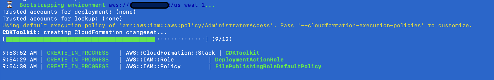
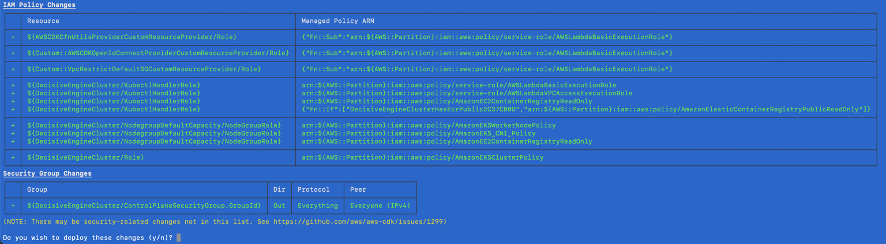
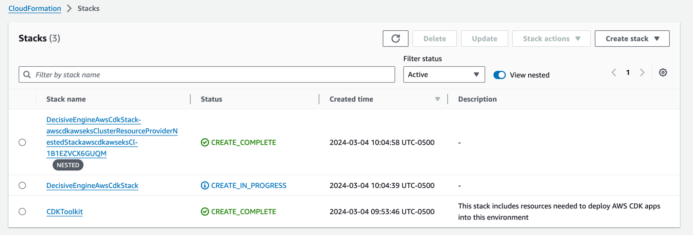
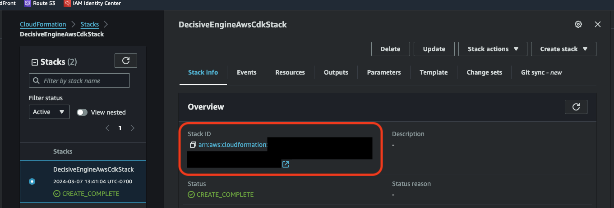

## Deploying to AWS

*🎶 Time for more [theme music](https://www.youtube.com/watch?v=ioE_O7Lm0I4) 🎶*

**💪 Congratulations! You're about to provision an MDAI Engine! 💪**


<div class="warning">
  IMPORTANT! After deployment, the engine will be active and running in AWS. The current version of the engine was designed to be as cost-effective as possible, however you should still carefully monitor your spend and manage your engine capacity accordingly. If the engine is not actively being used for testing or managing telemetry pipelines, you may wish to shut it down to minimize your spend.<br /><br />
  <em>We hope to have benchmarks soon for cost and performance of our engines.</em>
</div>

### Deploy the MDAI Engine

```shell
make install
```

<div class="warning">
  <b><em>Don't walk away just yet!</em></b>
  <p>There's one more manual verification step required before CloudFormation will deploy all necessary infrastructure to get your engine up and running as soon as possible.</p>
</div>


### The install workflow

1. The install will check and bootstrap the CDK Toolkit if it's not present for your configured region.
](../../media/bootstrap.png)

2. The CDK will output the detected changes and ask you to accept or reject the changes. Review all output carefully before proceeding!
](../../media/stack-details.png)

3. Follow the progress of the stack deployment process through the terminal interface.
[](../../media/stack-details.png)
*or AWS Console -> Cloud Formation*
[](../../media/cfn-status.png)

4.  The installation process will add a new context to your `kubeconfig`. You can switch context by running: `kubectl config use-context <desired_context>`
Detailed output will be stored into `cdk-output.json`.

### A few notes while your stack is being provisioned...

1. 🍿 Grab some popcorn! 🍿 Average install time is ~20-30 minutes.

2. 👀 Don't want to monitor your terminal? Check out your stack's provisioning status in the AWS Console.
```
<!-- Change AWS_REGION to the region you deployed to -->
https://AWS_REGION.console.aws.amazon.com/cloudformation/home?region=AWS_REGION#/stacks?filteringText=&filteringStatus=active&viewNested=true
```

3. 🏛️ View your stack's architecture in the CloudFormation Designer tool.

To find your stack ARN:

[](../../media/cfn-stack-arn.png)

```
<!-- Change AWS_REGION to the region you deployed to -->
<!-- Change STACK_ARN to your stack's ARN -- shown above  -->
https://AWS_REGION.console.aws.amazon.com/cloudformation/designer/home?region=AWS_REGION&stackId=<STACK_ARN>#
```

----

<center>
  <h3>Want to see how the MDAI Engine runs locally?</h3>
  <p>
    🛠️ Build a local version while you're waiting!
    <a href="../local/quick-start.md">
      QuickStart
    </a>
  </p>
</center>

----

<p style="text-align: center;">
  <a href="./configure.md">Back to Configure Your Engine</a>
</p>
<p style="text-align: center;">
  <a href="./verify.md">Next Step: Verify >></a>
</p>
