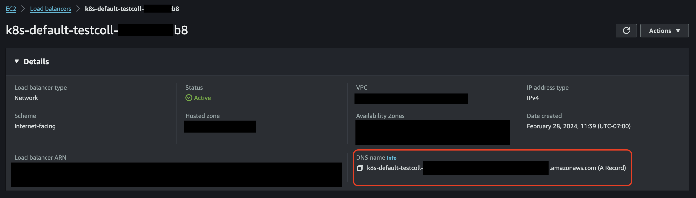
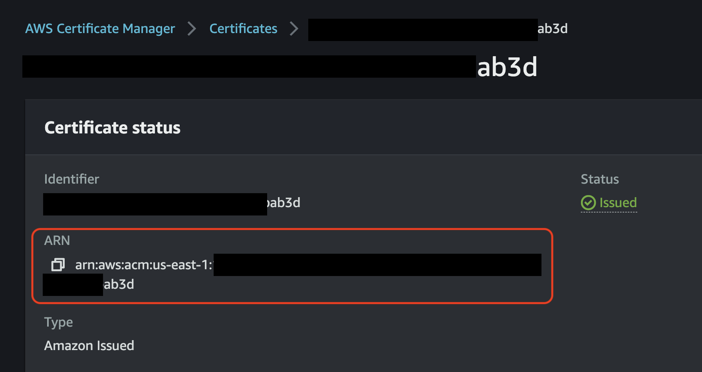

# Managing Ingress for the Engine's OTel Collector 

<!-- toc -->

## DNS

To expose the Engine's OpenTelemetry Collector to the public, we've simplified the provisioning of two types of Load Balancers.

1. AWS Application Load Balancer `mdai-grpc-endpoint`
2. AWS Network Load Balancer `mdai-non-grpc-endpoint`

These Load Balancers receive **gRPC** and **non-gRPC** (HTTP, TCP, UDP) data respectively.

The Load Balancers can be referred to by their DNS names, which are assigned by AWS. [](../../media/load-balancers.png)

> For secure connectivity, it’s highly recommended - and for TLS (SSL) endpoints, required - that you create CNAME DNS records in your domain, pointing to the Load Balancer DNS names generated by AWS.

### gRPC

In order to provide routing for multiple gRPC receivers of the same type, each receiver should have its own hostname in your public domain. Additional configuration steps are required to provide a mapping between the receiver name and its proposed hostname. A single gRPC Load Balancer will be able to manage ingest from multiple gRPC sources. The current version of the MDAI Engine only provisions a single gRPC Load Balancer by default.

#### Example

**LB DNS name:**
`mdai-grpc-endpoint.us-east-1.elb.amazonaws.com`

**OTel Collector Configuration Excerpt:**
( _This example has 2 gRPC receivers._ )

```yaml
service:
  pipelines:
    traces:
      receivers: [jaeger, otlp]
      processors: [memory_limiter, batch]
      exporters: [debug]
```

**Required CNAME records in domain `your-domain.io`:**
| CNAME | AWS DNS NAME | Access URL |
| ----------- | --------------- |------------ |
| `jaeger.grpc.endpoint` | `mdai-grpc-endpoint.us-east-1.elb.amazonaws.com` | `jaeger.grpc.endpoint.your-domain.io` |
| `otlp.grpc.endpoint` | `mdai-grpc-endpoint.us-east-1.elb.amazonaws.com` | `otlp.grpc.endpoint.your-domain.io` |

**Manual updates for OpenTelemetry Collector configuration**

You would then need to update your OTel configuration to reflect these changes before the MDAI Engine can receive telemetry via the Access URL.

Navigate to your `values/params-values-otel.yaml` file:

```yaml
collectorEndpoints:
  otlp: otlp.grpc.endpoint.collector.your-domain.io
  jaeger: jaeger.grpc.endpoint.collector.your-domain.io
```

### non-gRPC

#### Example

**LB DNS name**
`mdai-non-grpc-endpoint.us-east-1.elb.amazonaws.com`

**Required CNAME records in domain `your-domain.io`:**

| CNAME      | AWS DNS NAME                                         | Access URL                |
| ---------- | ---------------------------------------------------- | ------------------------- |
| `endpoint` | `mdai-non-grpc-endpoint.us-east-1.elb.amazonaws.com` | `endpoint.your-domain.io` |

## TLS (SSL)

TLS (SSL) Certificates should be generated and issued for all chosen host names.

**Steps for Issuing or Importing a Certificate**

- Choose to [Import](https://docs.aws.amazon.com/acm/latest/userguide/import-certificate-api-cli.html) or [Issue](https://docs.aws.amazon.com/acm/latest/userguide/gs.html) a Certificate
- Once you have access to your certificate in AWS ACM, it will be accessible via Amazon Resource Name (ARN). These ARNs need to be provided as a configuration parameter during the configuration phase, so make note of these ARNs. [](../../media/acm-certificates.png)

### gRPC

- TLS (SSL) is **MANDATORY** for the gRPC endpoint.

- From the example above, the gRPC host names that would need certificates are:

  - `jaeger.grpc.endpoint.your-domain.io`
  - `otlp.grpc.endpoint.your-domain.io`

- After identifying the certificate ARN, you are required to update the `values/params-values-otel.yaml` file:

```yaml
spec:
  ingress:
    annotations:
      alb.ingress.kubernetes.io/certificate-arn: arn:aws:acm:us-east-1:1234567890:certificate/th15-15-@n-@ut0g3n3r@ted-numb3r
```

### non-gRPC

- SSL is _not mandatory_, but is highly recommend for non-gRPC ingress.

- From the example above, the gRPC host name that would need a certificate is:

  - `endpoint.your-domain.io`

- After identifying the certificate ARN, you are required to update the `values/params-values-otel.yaml` file:

```yaml
metadata:
  name: test-collector
  namespace: default
  annotations:
	service.beta.kubernetes.io/aws-load-balancer-ssl-cert: arn:aws:acm:us-east-1:1234567890:certificate/th15-15-@n-@ut0g3n3r@ted-numb3r
```

## Console

### DNS

To expose your MDAI Console UI to the public Internet, an AWS Application Load Balancer `mdai-console` will be provisioned.
This Load balancer can be referred to by its DNS name, which is provided by AWS. For secure connectivity, it’s **highly recommended** - and for TLS (SSL) endpoints, required - that you create CNAME DNS records for your domain that point to the Load Balancer DNS names generated by AWS.

#### Example

**LB DNS name**: `mdai-console-12345678910.us-east-1.elb.amazonaws.com`

**Required CNAME records in domain `your-domain.io`:**
| CNAME | AWS DNS NAME | Access URL |
| ----------- | --------------- |------------ |
| `mdai-console` | `mdai-console-12345678910.us-east-1.elb.amazonaws.com` | `mdai-console.your-domain.io` |

### TLS (SSL)

TLS (SSL) can be enabled for the MDAI Console UI endpoint. In order to do that, a TLS (SSL) certificate should be issued for the chosen hostname (i.e. mydecisive.domain.dom from the example above), imported into the AWS ACM, and accessed via Amazon Resource Name (ARN).
This ARN needs to be provided as a configuration parameter during the configuration phase in the file: `values/aws.env`

Example:
`MDAI_UI_ACM_ARN=arn:aws:acm:us-east-1:12345678900:certificate/eaa7da72-1c8d-4277-8131-ab9dfdc35f37`

<br />

----

<p style="text-align: center;">
  <a href="./deploy.md">Back to Deploy Your Engine</a>
</p>
<p style="text-align: center;">
  <a href="./verify.md">Next Step: Verify Your Installation >></a>
</p>
