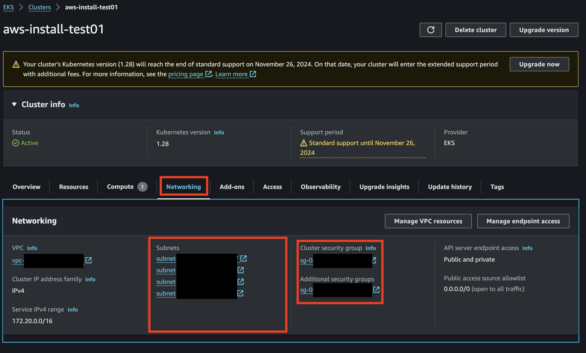

# 🥷 VPC Access
----

For secure access within a VPC, ensure your Kubernetes cluster and app are configured to operate within the VPC.

## Configuring VPC for EKS

### 1. Create EKS Cluster within VPC

During install you should have created an EKS cluster. You should be able to find your cluster name and region in the `aws.env` file used for cluster installation. You can use the following link to navigate to your cluster Networking settings and view the relevant subnets.

`https://<your-region>.console.aws.amazon.com/eks/home?region=<your-region>#/clusters/<your-cluster-name>?selectedTab=cluster-networking-tab`

Note the subnets and security groups are created for you. 

### 2. Configure Security Groups

Setup the correct [security group rules](https://docs.aws.amazon.com/AWSEC2/latest/UserGuide/security-group-rules-reference.html?icmpid=docs_ec2_console) for your desired security. 

### VPC Peering (if necessary):

If the app needs to communicate with resources in another VPC, you might consider
1. Setting up [VPC peering](https://docs.aws.amazon.com/vpc/latest/peering/what-is-vpc-peering.html) 
2. Setting up [route tables](https://docs.aws.amazon.com/vpc/latest/userguide/VPC_Route_Tables.html)

----
<a href="../validate.md">⏪ Back to: Validate Installation</a>
<a href="../lifecycle/overview.md">Next Step: Lifecycle Overview ⏩</a>