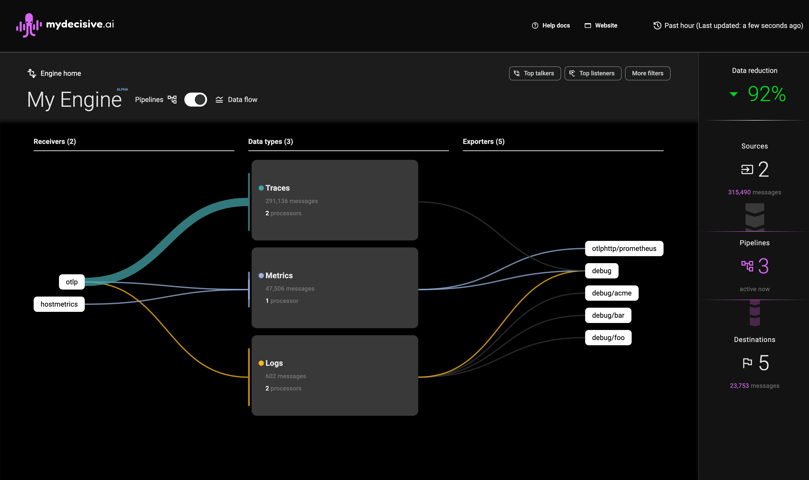

## Validate data flow

1. Go to your AWS lb link to view the MDAI Console in AWS.
3. As telemetry flows through the engine, you will see counts increase in the console, color-coded by telemetry type. 🐙🎉

> Note: Data flowing to `debug` exporters are not counted towards data flow totals in the right sidebar

