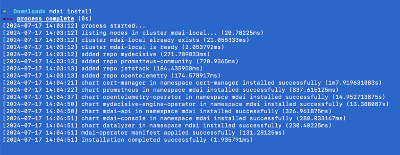
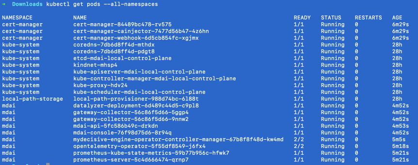

# Install and manage local MDAI cluster with CLI

Our CLI will help you install and manage MDAI clusters locally.  

## Prerequisite
Since we are using [kind](https://kind.sigs.k8s.io/docs/user/quick-start/) cluster you have to have [Docker](https://docs.docker.com/engine/install/) installed.

## Download and install MDAI CLI 
### Install prebuilt binary via shell script
This command will download and install release v.0.1.0, you can check and download the latest release [here](https://github.com/DecisiveAI/mdai-cli/releases).
```shell
curl --proto '=https' --tlsv1.2 -LsSf https://github.com/decisiveai/mdai-cli/releases/download/v0.1.0/mdai-installer.sh | sh
```
### Install via Homebrew
To install prebuilt binaries via homebrew
```Shell
brew install decisiveai/tap/mdai
```

## Install MDAI cluster
To install MDAI cluster into local kind cluster run
```Shell
mdai install
```
It will take couple minutes to spin up your cluster and have all k8s pods up and running.
  

  
You can check pod status by running
```Shell
kubectl get pods --all-namespaces
```
Which should look like:
   


## Manage MDAI cluster

Our CLI has a sample cluster defined and built in into installation process.  
It starts two replicas of "gateway" OTEL collectors.  
Let's check OTEL collectors configuration by running:
```Shell
mdai get --config otel
```
   
For a full reference of CLI commands check [here](https://github.com/DecisiveAI/mdai-cli/blob/main/docs/md/mdai.md) or run:
```Shell
mdai --help
```
----

  <span class="left"><a href="./automated-install.md">⏪ Back to Automated installation</a></span>
  <span class="right"><a href="./verify.md">Next Step: Verify ⏩</a></span>