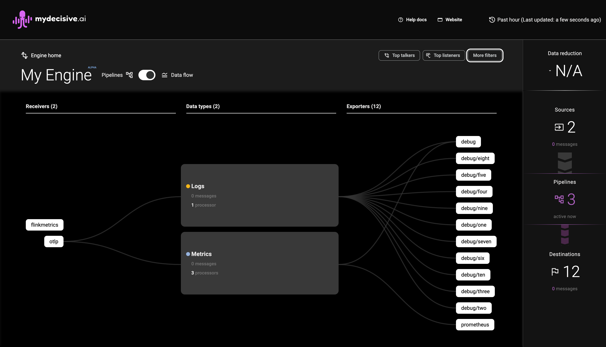

#  Create an MDAI Engine instance locally

>*NOTE: These docs are for MDAI Engine installation on your local machine. We are updating documentation frequently. Thank you for your patience*

# Quick Start Guide

<!-- toc -->

## Setup the MDAI Engine locally

You are going to learn to do the following in less than five minutes:

- Set up and run a local instance of MDAI Engine
- Send telemetry to the MDAI Engine
- Access MDAI Engine Console to verify data flowing through the MDAI Engine.

## Prerequisites

<div class="warning">
  <b>System Dependencies</b>
  <ul>
    <li>These docs assume that you have <a href="https://brew.sh/" target="_blank">homebrew</a> installed.</li>
    <li>If you're using MacOS, you'll also need <a href="https://mac.install.guide/commandlinetools/" target="_blank">XCode Commandline Tools</a> installed.</li>
    <li>You will also need to have <a href="https://kubernetes.io/releases/download/" target="_blank">Kubernetes</a> installed.</li>
  </ul>
</div>

### Automated installation

Our automated installation process is setting up all the required dependencies like
- Docker
- Kind cluster
- Npm
- Aws CDK
- Go
- Helm (we support [Helm v3.13.0](https://github.com/helm/helm/releases/tag/v3.13.0) and later)

>_Note: Once the Engine installed your k8s context will be switched automatically to new cluster._

Here are installation steps:

1. Pull down the latest from the [MDAI infrastructure installation repo](https://github.com/DecisiveAI/mdai-inkops)
2. Install [kind](https://kind.sigs.k8s.io/docs/user/quick-start/) for local cluster management using docker containers
3. Run automated installation script
```bash
make -f ./make/Makefile-local-recipes create-mdai
```

<div class="warning">
   <b>Other steps:</b>
   Upon installation you encounter an error where Docker is the culprit, please ensure the docker daemon is running. If this doesn't fix the error, feel free to:
   <ul>
      <li>
         Email us at <a href="mailto:support@mydecisive.ai">support@mydecisive.ai</a>
      </li>
      <li>
         File an issue under the <a href="https://github.com/DecisiveAI/mdai-inkops">MDAI InkOps Project</a>
      </li>
   </ul>
</div>

### Automated uninstall

Make sure your k8s context is set to `kind-mdai-local` cluster:

```bash
kubectl config get-contexts
```

Switch the context if needed:

```bash
kubectl cluster-info --context kind-mdai-local
```

Run automated de-installation script

```bash
 make -f ./make/Makefile-local-recipes delete-mdai
```

If you want to remove all helm artifacts installed (you don't use it your other local setup), run the following

```bash
 make -f ./make/Makefile-local-recipes delete-mdai-all
```

### Manual pre-req installations

- Install [Go](https://go.dev/dl/) (1.20 or higher).
- [GOBIN environment variable](https://pkg.go.dev/cmd/go#hdr-Environment_variables) is set; if unset, initialize it appropriately, for example:
 ```bash
 export GOBIN=${GOBIN:-$(go env GOPATH)/bin}
 ```
- Install [npm](https://nodejs.org/en/download)
- Install [aws-cdk](https://docs.aws.amazon.com/cdk/v2/guide/cli.html)
- Install [docker](https://www.docker.com/get-started/)
- Install [kind](https://kind.sigs.k8s.io/docs/user/quick-start/) for local cluster management using docker containers

## Setup Environment

1. Create a cluster where the Engine can be installed. For our example, we'll use kind.
   > ```@bash
   > <!--  Create cluster -->
   > kind create cluster --name mdai-local
   >
   > <!-- Check that your cluster is up and running -->
   > kind get clusters
   > ```
2. Setup and configure a local instance of the MDAI Engine

   > ````@bash
   > make local-deploy
   > kubectl-config
   > ````

3. Ensure your cluster is up and running.

   > ```@bash
   > kubectl get pods
   > ```
   >
   > _Note: the pod that starts with `mydecisive-engine-ui-_`\*

4. Enable port forwarding from cluster to localhost

   > ```
   > <!-- Example kubectl port-forward mydecisive-engine-ui-578f644b7-k9q47 5173:5173 -->
   >
   > kubectl port-forward <POD_NAME> <PORT>:<PORT>
   > ```

5. View the MDAI Console at [http://localhost:5173](http://localhost:5173) 🐙🎉



## Generate and Collect telemetry

1. Install OpenTelemetry's [telemetrygen](https://github.com/open-telemetry/opentelemetry-collector-contrib/tree/main/cmd/telemetrygen) utility.
   > ```@bash
   > go install github.com/open-telemetry/opentelemetry-collector-contrib/cmd/telemetrygen@latest
   > ```
2. Send Telemetry to the collector
   > ```@bash
   > $GOBIN/telemetrygen traces --otlp-insecure --traces 3
   > ```
3. _Optional: Add a cronjob to schedule telemetry at a cadence_
   > ```
   > TODO: command goes here!
   > ```

## Validate data flow

1. View the [local MDAI console](http://localhost:5173)
2. As telemetry flows through the engine, you will see counts increase in the console, color-coded by telemetry type. 🐙🎉


> Note: Data flowing to `debug` exporters are not counted towards data flow totals in the right sidebar
