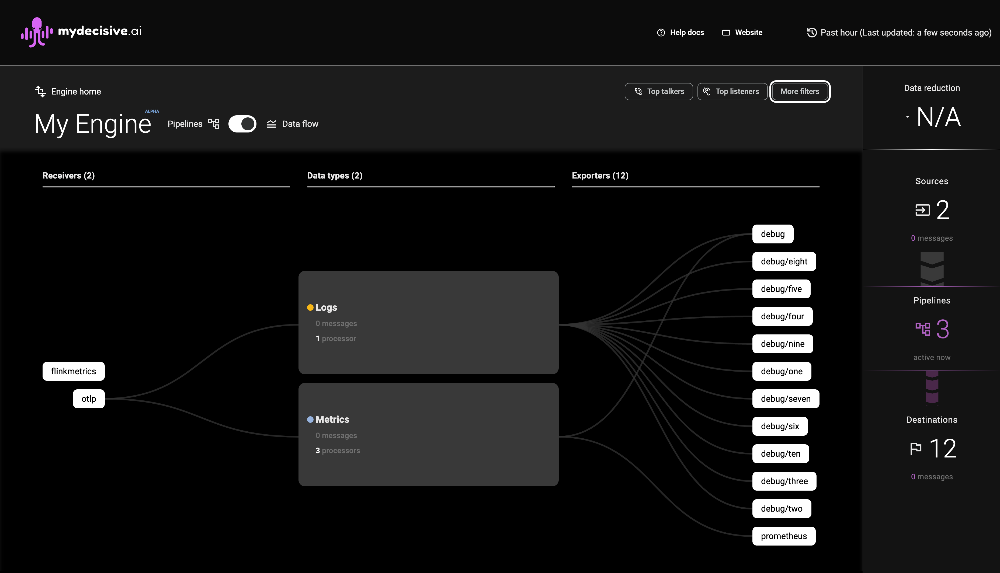

# Setup Environment
----
1. Create a cluster where the Engine can be installed. For our example, we'll use kind.
   > ```@bash
   > <!--  Create cluster -->
   > kind create cluster --name mdai-local
   >
   > <!-- Check that your cluster is up and running -->
   > kind get clusters
   > ```
2. Setup and configure a local instance of the MDAI Engine

   > ````@bash
   > make local-deploy
   > kubectl-config
   > ````

3. Ensure your cluster is up and running.

   > ```@bash
   > kubectl get pods
   > ```
   >
   > _Note: the pod that starts with `mydecisive-engine-ui-_`\*

4. Enable port forwarding from cluster to localhost

   > ```
   > <!-- Example kubectl port-forward mydecisive-engine-ui-578f644b7-k9q47 5173:5173 -->
   >
   > kubectl port-forward <POD_NAME> <PORT>:<PORT>
   > ```

5. View the MDAI Console at [http://localhost:5173](http://localhost:5173) 🐙🎉




----
<span class="left"><a href="./remove.md">⏪ Back to Removal</a></span>
<span class="right"><a href="./generate-collect.md">Generate and Collect Telemetry ⏩</a></span>

