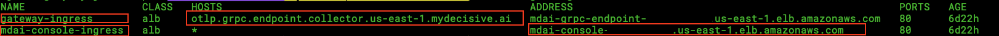
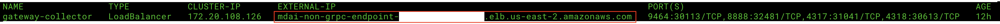
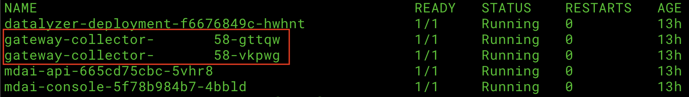

#  Using curl or grpcurl to send data to MDAI Cluster

⚠️ Note: These docs assume you have already [installed an MDAI Cluster](https://docs.mydecisive.ai/install/installation.html)! ⚠️

## Finding and setting `HTTP_HOST` and `GRPC_HOST` 

Not sure where to get the variables for `GRPC_HOST` and `HTTP_HOST`?
* I need my Cloud env. variables [Get them now!](./README.md#cloud)
* I need my Local env. variables [Get them now!](./README.md#cloud)

### Cloud

#### GRPC_HOST & GRPC PORT

You can find your `GRPC_HOST` value by running: 

```shell
kubectl get ingress -n default
```

Your output should look something like this...

<a href="./media/ingress-output.png" target="_blank">
  
</a>

For `gateway_ingress`, note the `HOSTS` value. This will be used for your `GRPC_HOST`

Your `GRPC_PORT` will always be `:443`, as this is the secure listener for your gRPC endpoint.

*You can also make note of the `mdai-console-ingress`, `ADDRESS` value to validate requests sent from postman later.*

#### HTTP_HOST & HTTP_PORT

You can find your `HTTP_HOST` value by running: 

```shell
kubectl get svc gateway-collector -n default
```

Your output should look something like this...

<a href="./media/service-output.png" target="_blank">
  
</a>


For the `gateway_collector` service, note the `EXTERNAL-IP` value. This will be used for your `HTTP_HOST`

Your `HTTP_PORT` will always be `:4318`, as this is the secure listener for your http endpoint.


### Local

For Local testing your `GRPC_HOST` and `HTTP_HOST` will always be `localhost`.


#### Port-forward your ingress endpoints

The ports, however, will need to be forwarded to their respective testing ports. Luckily there are two pods created during cluster install. You should be able to forward each of them to retrieve requests, one for `http` and another to `gRPC` requets.

```shell
kubectl get pod
```

Your output should look like...

<a href="./media/pods-output.png" target="_blank">
  
</a>

Make note of your `gateway-collector` pod names. For simplicity we will use the ports: 
* `4713` for gRPC requests 
* `4813` for http requests

```shell
GRPC_PORT=4317
HTTP_PORT=4318
```


**Now let's forward those ports!**

```shell
# Example port-forward request
kubectl port-forward <POD_NAME> <PORT>:<PORT>

# gRPC Example 

kubectl port-forward gateway-collector-abcd123-xyz1 4318:4318

# HTTP Example

kubectl port-forward gateway-collector-abcd123-1zyx 4317:4317
```


## Set the `*_OTLP_ENDPOINT` variables in your terminal

```shell
HTTP_HOST=<ENTER THIS USING THE OUTCOME FROM ABOVE STEPS>
HTTP_PORT=<ENTER THIS USING THE OUTCOME FROM ABOVE STEPS>
GRPC_HOST=<ENTER THIS USING THE OUTCOME FROM ABOVE STEPS>
GRPC_PORT=<ENTER THIS USING THE OUTCOME FROM ABOVE STEPS>
GRPC_OTLP_ENDPOINT="$GRPC_HOST:$GRPC_PORT"
HTTP_OTLP_ENDPOINT="$HTTP_HOST:$HTTP_PORT"
```

## Start firing off requests

### Sending a curl

Send a `curl` request to the collector (e.g. for Logs):

```shell
# execute the request using the data from the example log data file
curl -X POST -H "Content-Type: application/json" -d @./examples/http_service/logs.json -i http://${HTTP_OTLP_ENDPOINT}/v1/logs
```


### Sending a grpcurl

#### Pre-req Install grpcurl

Install `grpcurl` using your preferred method in the [grpcurl Installation Guide](https://github.com/fullstorydev/grpcurl)

or 

Via homebrew
```shell
brew install grpcurl
```

#### Send a request

<div class="warning">
  <strong>Warning</strong>: You must run this command from the directory where you copied our <a href="https://github.com/DecisiveAI/mdai-inkops/tree/main" target="_blank">InkOps repo</a>. You may also copy the <a href="https://github.com/DecisiveAI/mdai-inkops/tree/main/examples" target="_blank"><code>/examples</code></a> directory from the InkOps repo, and run this command from that location on your machine. You may need to change the path if you copy the `/example` directory to your machine.
</div>

```shell
# use data from ./examples/grpc_service/logs.json AND
# run the request using the data (as stdin) copied from above
```shell
cat ./examples/grpc_service/logs.json |
grpcurl -vv -insecure \
    -d @ \
    -proto examples/protos/opentelemetry/proto/collector/logs/v1/logs_service.proto \
    -import-path examples/protos \
    $GRPC_OTLP_ENDPOINT \
    opentelemetry.proto.collector.logs.v1.LogsService/Export
```

> **Note**: Remember to change the Service path and Service Namespace when sending other signals (traces/metrics).


## Feedback 

Are you experiencing issues or would like to submit a request to our team?
* Email us at <a href="mailto:support@mydecisive.ai" target="_blank">support@mydecisive.ai</a>
* File an issue under the <a href="https://github.com/DecisiveAI/postman/issues/new" target="_blank">MDAI Postman</a>


<br />
<br />
<br />

----


## Coming from Local Install?

<span class="left" style="width: 50%">
  <a href="./local/testing.md">⏪ Back to Sending Data to MDAI</a>
</span>
<span class="right" style="width: 50%">
  <span>Want to validate telemetry data flowing through your pipelines?</span>
  <br />
  <a href="./local/validate.md">Next Step: Validate ⏩</a>
  <br />
  <br />
  <span>Know how to validate data flow already?</span>
  <a href="congrats.md">Next Step: Congrats! ⏩</a>
</span>

<br />
<br />
<br />
<br />
<br />

## Coming from AWS Install?

<div>
  <span class="left" style="width: 50%">
    <a href="./aws/verify.md">⏪ Back to Verify Installation</a>
  </span>
  <span class="right" style="width: 50%">
    <span>Want to validate telemetry data flowing through your pipelines?</span>
    <br />
    <a href="./aws/validate.md">Next Step: Validate ⏩</a>
    <br />
    <br />
    <span>Know how to validate data flow already?</span>
    <a href="congrats.md">Next Step: Congrats! ⏩</a>
  </span>
</div>
