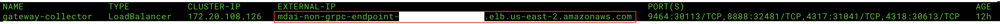

# Using a real agent/collector to send data to MDAI Cluster

>Visit the [OTel Collector Docs site](https://opentelemetry.io/docs/collector/configuration/) to learn more about configuring your collector based on your specific data sources and destinations.

## General setup and connectivity from collector to MDAI

1. Determine which sources of data (collector/agent) you'd like to point at your MDAI Cluster instance.
2. Use your CNAME (from your host provider) or DNS (from AWS LB) as mentioned in our [Ingress documentation](../../advanced/ingress.md).
3. Configure your agent/collector to point to the CNAME or DNS as mentioned in our [Ingress documentation](../../advanced/ingress.md).
4. SEE RESULTS! [Verify data flow](./verify.md)

### Where can I find my ingress endpoints?

## Finding and setting `HTTP_HOST` and `GRPC_HOST` 

Not sure where to get the variables for `GRPC_HOST` and `HTTP_HOST`?
* I need my Cloud env. variables [Get them now!](./README.md#cloud)
* I need my Local env. variables [Get them now!](./README.md#cloud)

### Cloud

#### GRPC_HOST & GRPC PORT

You can find your `GRPC_HOST` value by running: 

```shell
kubectl get ingress -n default
```

Your output should look something like this...

<a href="./media/ingress-output.png" target="_blank">
  
</a>

For `gateway_ingress`, note the `HOSTS` value. This will be used for your `host`

Your `port` will always be `:443`, as this is the secure listener for your gRPC endpoint.

*You can also make note of the `mdai-console-ingress`, `ADDRESS` value to validate requests sent from postman later.*

> Note: Your ingress endpoint for gRPC connections will be in the following format...
> `${host}:${port}`

#### HTTP_HOST & HTTP_PORT

You can find your http ingress endpoint value by running: 

```shell
kubectl get svc gateway-collector -n default
```

Your output should look something like this...

<a href="./media/service-output.png" target="_blank">
  
</a>

For the `gateway_collector` service, note the `EXTERNAL-IP` value. This will be used for your `host`

Your `port` will always be `:4318`, as this is the secure listener for your http endpoint.

> Note: Your ingress endpoint for http connections will be in the following format...
> `https://${host}:${port}`

### Examples coming soon

While we know these docs will help guide you to the right configuration, we understand you might need further help. We're actively working on examples connecting commonly used collectors/agents to an MDAI Cluster. 

If you have special requests for how-to-guides..
* Email us at <a href="mailto:support@mydecisive.ai" target="_blank">support@mydecisive.ai</a>
* File an issue under the <a href="https://github.com/DecisiveAI/mdai-inkops/issues/new" target="_blank">MDAI InkOps Project

----
<span class="left"><a href="../installation.md">⏪ Back to Intro: Generate and Receive Telemetry</a></span>
<span class="right"><a href="./telemetrygen.md">Next Step: TelemetryGen ⏩</a></span>