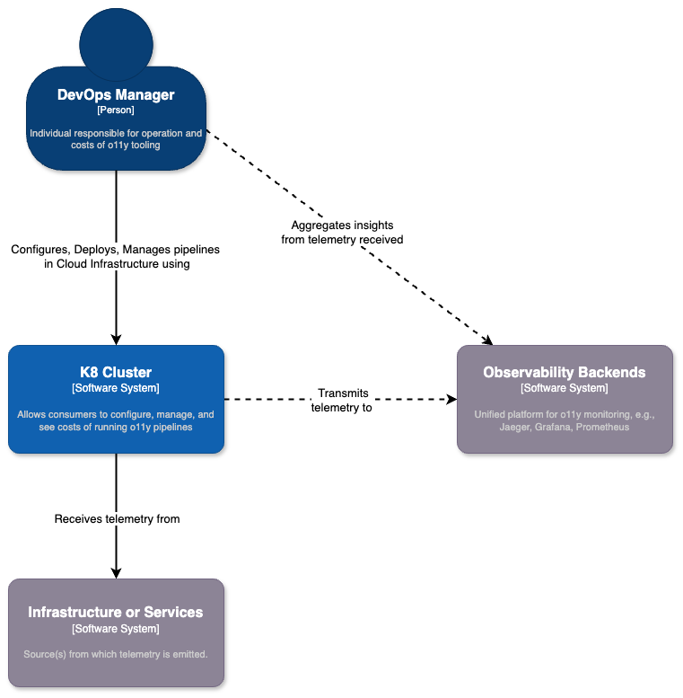

# Architecture Overview

<!-- toc -->

## 10,000 ft. view

We want to simplify the lives of DevOps teams by providing an on-prem (in your own cloud) solution that can give full control over telemetry pipelines, while maintaining existing use of Observability Platforms and/or tools.

## 1,000 ft. view

Here's a brief diagram for how we are using our preferred technologies to build our infrastructure to help the DevOps community!

## What super powers the MDAI Cluster?

### Kubernetes (K8s)
Kubernetes is a powerful container orchestration platform that automates deployment, scaling, and management of containerized applications. It provides a flexible and scalable infrastructure for running modern microservices architectures, enabling rapid development, deployment, and scaling of applications. To learn more about k8s, visit <a href="https://kubernetes.io" target="_blank" rel="noopener">kubernetes.io</a>.

### OpenTelemetry (OTel)
OpenTelemetry is an open-source observability framework that enables standardization and instrumentation of telemetry data across distributed systems. By integrating OTel with your applications, you can automatically capture and export metrics, traces, and logs, providing deep insights into application behavior, performance, and dependencies.

### Prometheus
Prometheus is an open-source monitoring and alerting toolkit designed for reliability and scalability in dynamic environments like Kubernetes. It excels at collecting and storing time-series data, enabling real-time monitoring, querying, and alerting based on application metrics, service health, and resource utilization.

## Why use these technologies together?

### Unified Observability
Integrating Prometheus, OTel, and Kubernetes allows for unified observability across the entire application stack. You can collect metrics, traces, and logs from Kubernetes resources, containerized applications, and infrastructure components, providing holistic insights into system health, performance, and behavior.

### Dynamic Environment Support
Kubernetes' dynamic nature requires a monitoring solution that can adapt to changes in application topology and resource allocation. Prometheus and OTel are well-suited for dynamic environments, providing auto-discovery, dynamic instrumentation, and flexible querying capabilities.

### Standardization and Interoperability
OpenTelemetry promotes standardization and interoperability by providing consistent instrumentation and telemetry formats across different programming languages, frameworks, and observability tools. By integrating Prometheus and OTel, you can leverage a common telemetry format and instrumentation library, facilitating data sharing and analysis across the ecosystem.

### Scalability and Extensibility
Prometheus and OTel are designed for scalability and extensibility, making them suitable for monitoring large-scale, distributed systems running on Kubernetes. You can scale your monitoring infrastructure horizontally to handle increased workload and integrate additional observability tools and services as needed.

 
 

----

  <em>Want to jump ahead to install? Wait no more!</em> 
  <a href="./install/installation.md">Installation guide ⏭️</a>

