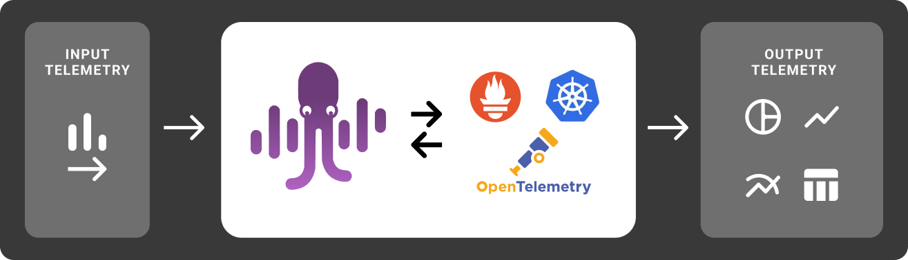

# Overview

The MDAI Engine™ empowers users to manage their observability data pipelines and associated vendor platform costs via insights from self-monitoring.

](../media/overview.png)

Read more about the tools that super power us!
1. [Kubernetes](https://kubernetes.io/)
2. [Prometheus](https://prometheus.io/)
3. [OpenTelemetry](https://opentelemetry.io/)

... Or you can check out our [Architecture](./architecture.md) to understand more about our infrastructure.
