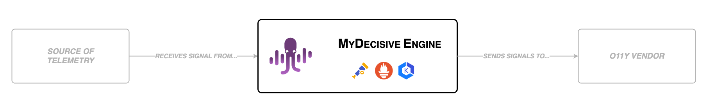

# ⚠️ **Alpha Disclaimer**
This open-source project is currently under construction and is subject to frequent changes and updates. For more information about our alpha release, see our [Alpha Disclaimer](./DISCLAIMER.md)

----

# Overview

The MDAI Cluster provides a self-service control plane for OpenTelemetry, making it simple for users to oversee their observability telemetry and control costs efficiently.

## 📚 What is an MDAI Cluster?

Curious about what our cluster offers? 

[Let us inform you!](./intro/intro.md)

## 🌐 We're Open-Source

We will always be committed to improving open source, whether it's in-house or back to the community. 

[Learn more](./intro/open-source.md)

## 🏛️ Our Architecture

Curious about what super-powers our infrastructure? 

[We're happy to share!](./intro/architecture/architecture.md)

## 🚀 Installation

Ready to install? We have a few options for both learning and production use! 

[Let's learn!](./install/installation.md)

## 🚢 Start Sending Data

Ready to send your MDAI Cluster data? We have a few methods.

[Start sending now!](./install/testing/intro.md)

## 📈 Usage Guide

Already installed a cluster, but want to learn more about usage? 

[We will show you the way!](./usage/usage.md)

 
 

----

  <em>Want to jump ahead to install? Wait no more!</em> 
  <a href="./install/installation.md">Installation guide ⏭️</a>

