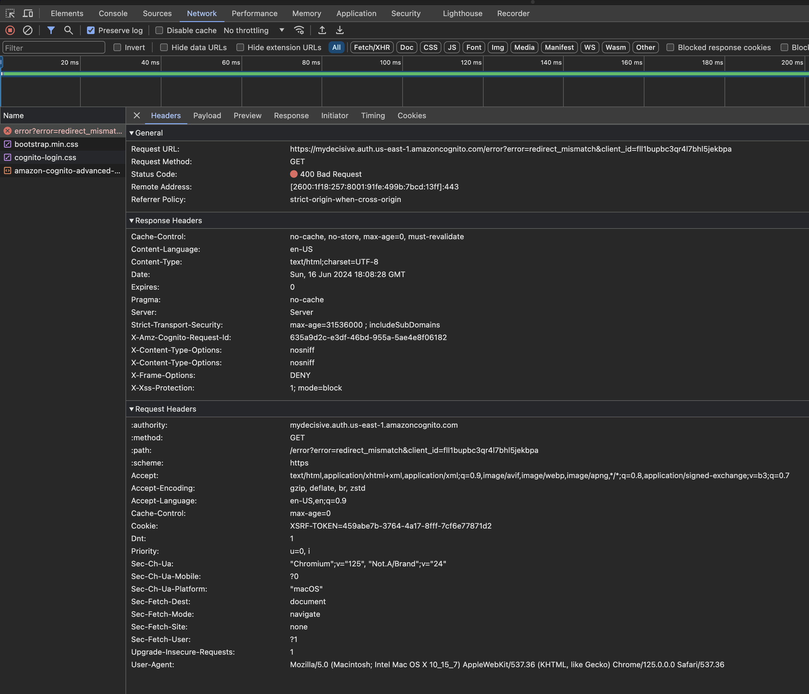
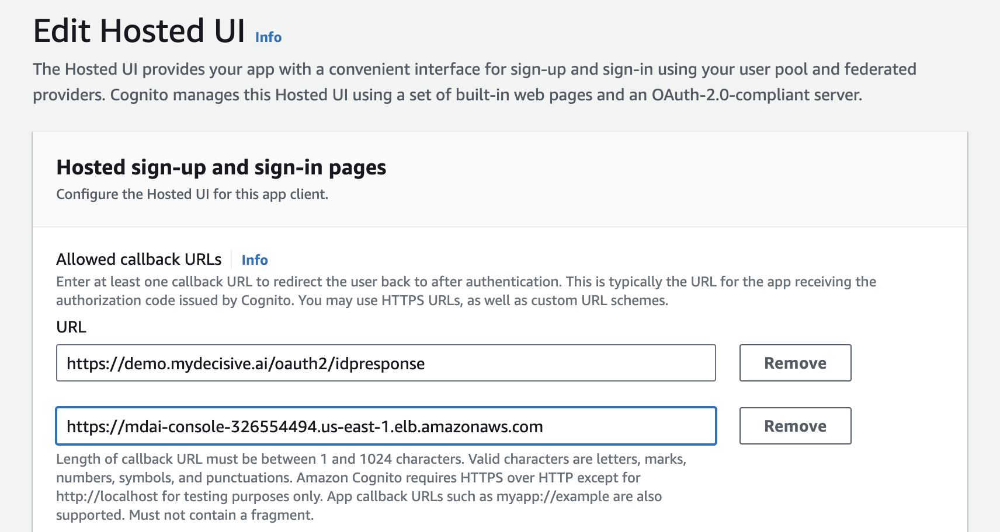

# Troubleshooting

<!-- toc -->

## 🐞 Known issues

### Docker daemon not started

Upon installation you encounter an error where Docker is the culprit, please ensure the docker daemon is running. Here's a helpful [docker guide](https://docs.docker.com/config/daemon/start/)" to help resolve this issue.

An alternative to using the command line to start the Docker daemon is to open the Docker Desktop application.


This is an example of the error you would see during install related to the docker daemon. 
[](./media/docker-error.png)


### Script timeout during automated install

This is an example of the error you would see during the automated install if there is a timeout.
[](./media/script-deadline-exceeded.png)


> 🤔 *What can I do to fix it? ... It depends on where the error occurs during timeout. Let's investigate some potential fixes!*


#### Option 1: Run a make target following a common breaking point

We've noticed the the typical timeout location is immediately following the `✅ Complete mdai-wait-for-pods!` checkpoint. You should be able to run the following command to finish the install process.
```bash
make -f ./make/Makefile-local-install mdai-deploy-config
```

#### Option 2: Re-run the automated install process

If you errored out at a different checkpoint, try running the `make -f ./make/Makefile-local-recipes create-mdai
` command again. 

#### Option 3: Report an issue to us!
Still not working? Please [report a new GitHub issue](https://github.com/DecisiveAI/mdai-inkops/issues/new)! 


### Cognito callback url not configured to your domain

This is an example of the error you would see during the automated install if there is a timeout.
[](./media/cognito-error.png)

How to fix... 


#### Option 1: Add your LB url as the callback url

Go to your AWS Cognito UserPool settings and add a callback url that represents your load balancer's URL.
[](./media/cognito-fix.png)


#### Option 2: Create a CNAME record for your MDAI Console in your domain host. 

Go to your host for your domain (e.g., GoDaddy) and add a CNAME record using your load balancer's DNS name to map to the key/value map for `MDAI_UI_USER_POOL_DOMAIN` you set in the `aws.env` file.


## 🔎 Report a new issue!

If this doesn't fix the error, feel free to:
* Email us at <a href="mailto:support@mydecisive.ai" target="_blank">support@mydecisive.ai</a>
* File an issue under the <a href="https://github.com/DecisiveAI/mdai-inkops/issues/new" target="_blank">MDAI InkOps Project</a>

